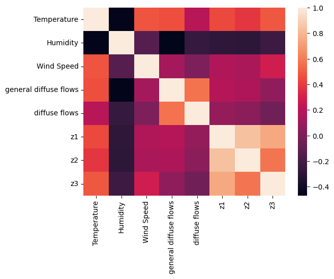
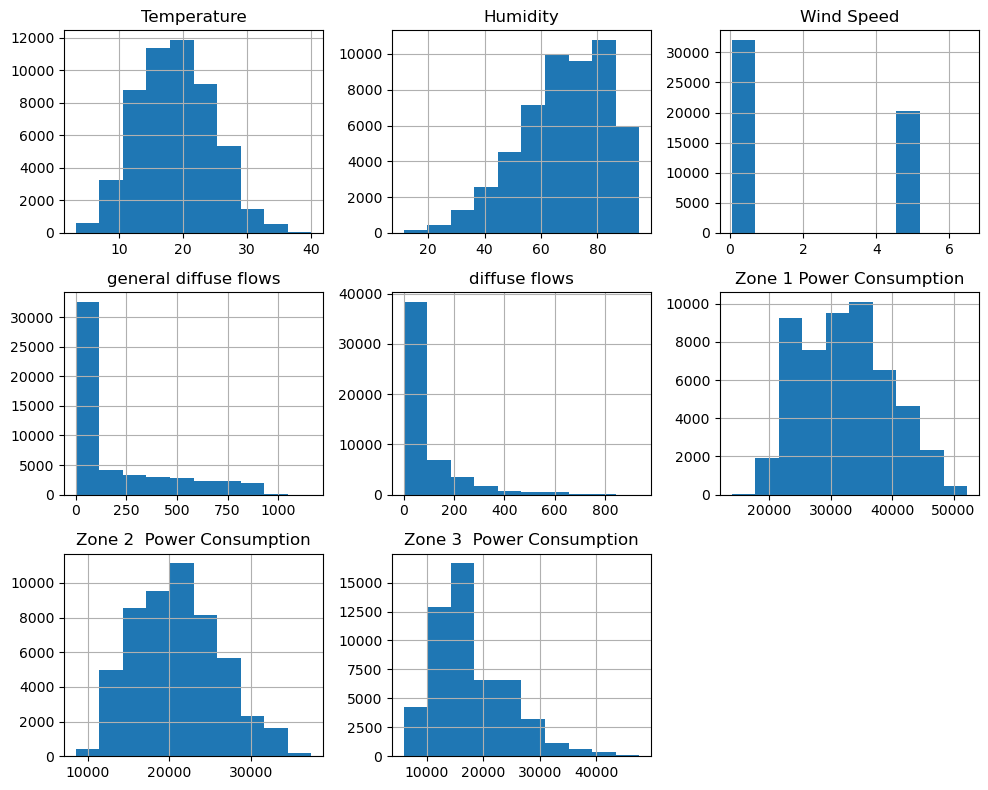
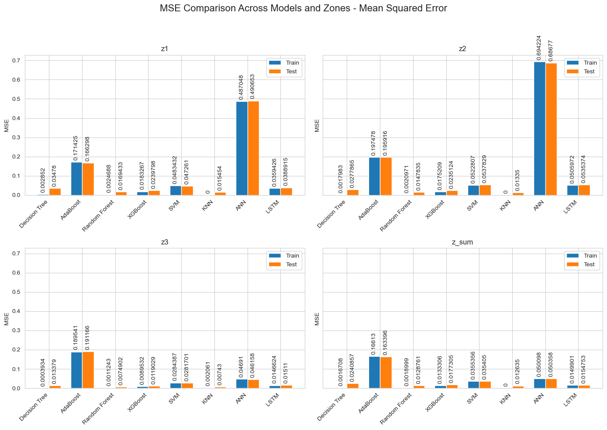
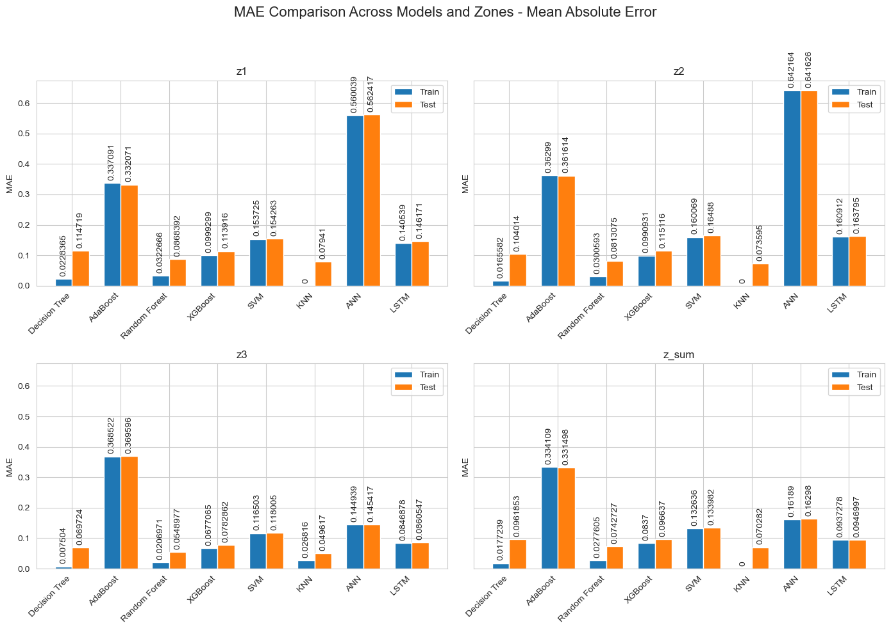
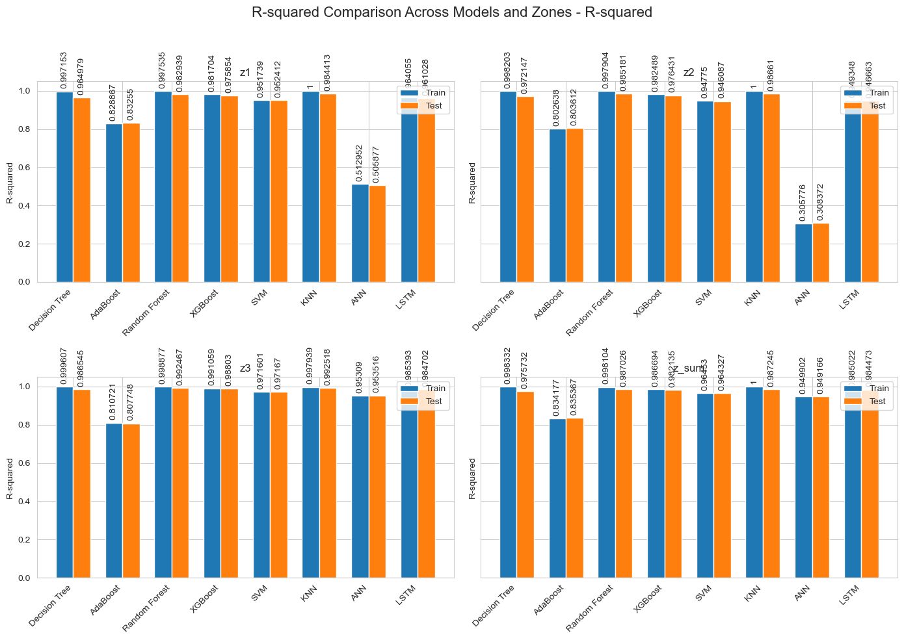

# Machine Learning Project
### Team members:
- Makdour Salah Eddine.
- Chellal Abdelhak.
- Baaziz Mohammed Chaker.

# Abstract

This project focuses on analyzing and predicting the power consumption of Tetouan City using various machine learning algorithms. The dataset consists of energy usage patterns from three distinct distribution networks in the city, recorded at ten-minute intervals. By applying regression models, the project aims to predict power consumption based on multiple features, including temperature, humidity, wind speed, and solar radiation. The results demonstrate the effectiveness of different models and provide insights into the energy consumption patterns of Tetouan City.

# Introduction

In this machine learning project, our focus was on addressing the issue of predicting power consumption in Tetouan City, situated in northern Morocco. The dataset provided us with valuable insights into the power consumption across three distinct distribution networks within the city. The data's time series nature presented both challenges and opportunities, as we aimed to extract meaningful information from temporal patterns and build effective regression models.
To achieve our goal, we explored a variety of machine learning algorithms to determine which model performs best in predicting power consumption. The models we tested included Artificial Neural Networks (ANNs), Long Short-Term Memory (LSTM) networks, decision trees, k-nearest neighbors (KNN), Naive Bayes, and Support Vector Machines (SVM). Each model was evaluated based on key performance metrics, namely Mean Squared Error (MSE), R-squared (R2), and Mean Absolute Error (MAE).
Our methodology involved treating each distribution zone individually to understand consumption patterns within specific areas before extending our analysis to encompass the entire city. This approach allowed us to tailor our models to the unique characteristics of each zone, ensuring more accurate predictions.
The main objective of our project was to identify the most suitable model that could accurately predict power consumption. By comparing the performance of different models and approaches, we aimed to discover the best techniques for forecasting energy demand. This predictive capability is crucial for better resource management and planning in Tetouan City, enabling local authorities to optimize energy distribution and minimize wastage.
In summary, this project not only sought to compare various machine learning models but also to apply these models in a practical context, providing valuable insights and tools for enhancing the efficiency of power consumption management in Tetouan City.
Dataset Description (1-2 pages) 
The dataset utilized in this project pertains to the power consumption of Tetouan City, located in northern Morocco. Donated on August 13, 2023, this dataset offers comprehensive insights into the energy usage patterns across three distinct distribution networks within the city. Its multivariate and time-series nature makes it an excellent candidate for applying various machine learning models aimed at regression tasks.
Dataset Characteristics:
 Type: Multivariate, Time-Series            Subject Area: Social Science           Associated Tasks: Regression
    Feature Types: Real, Integer               Number of Instances: 52,417         Number of Features: 6
Variable Descriptions:
1. **DateTime (Feature):** This feature represents the timestamp of each data entry, recorded at ten-minute intervals. 
2. **Temperature (Feature):** Continuous variable capturing the weather temperature in Tetouan City. Temperature fluctuations are critical in understanding energy consumption patterns, as they influence heating and cooling needs.
3. **Humidity (Feature):** Continuous variable indicating the humidity levels. Like temperature, humidity can impact energy usage, particularly in systems requiring climate control.
4. **Wind Speed (Feature)**: Continuous variable measuring the wind speed. Wind speed data can be significant for understanding the external environmental conditions affecting power consumption.
5. **General Diffuse Flows (Feature)**: Continuous variable representing general diffuse solar radiation. Solar radiation data is essential for energy studies, particularly in understanding the influence of natural lighting and potential solar power integration.
6. **Diffuse Flows (Feature)**: Continuous variable capturing specific diffuse solar radiation. This feature further refines the analysis of solar impact on energy usage.

**Figure 1**: Correlation matrix of features

1. **Zone 1 Power Consumption (Target)**: Continuous variable indicating the power consumption in Zone 1 of Tetouan City. This serves as one of the primary targets for the predictive models.
2. **Zone 2 Power Consumption (Target)**: Continuous variable representing the power consumption in Zone 2. This target helps in understanding the energy demands of different areas within the city.
3. **Zone 3 Power Consumption (Target)**: Continuous variable showing the power consumption in Zone 3. Analyzing this target allows for a comprehensive view of the city's power distribution and consumption.

The dataset contains no missing values, ensuring that the analysis and model training processes are not hindered by data imputation issues.

**Figure 2**: Distribution of features

# Methodology

In this project, we compared several machine learning algorithms, including:
-  Decision Tree: {'max_depth': 19}
-  AdaBoost: {'learning_rate': 1, 'loss': 'exponential', 'n_estimators': 100}
-  Random Forest: {n_estimators=100, criterion='squared_error', max_depth=None}
-  XGBoost: Base Model
- Support Vector Machine (SVM): {kernel='rbf', degree=3, C=1} 
- K-Nearest Neighbors (KNN), Artificial Neural Networks (ANN), Long Short-Term Memory (LSTM), and Naive Bayes (with target binning). The methodology involved the following steps:

1. **Data Cleaning and Feature Engineering:** The raw dataset was preprocessed to handle missing values, outliers, and feature scaling. New features such as `Year`, `IsWeekend`, `IsNight`, `HourCos`, `HourSin`, `MonthCos`, `MonthSin`, `DayCos`, and `DaySin` were created to capture temporal patterns.

2. **Feature Selection:** Features were selected based on their relevance to the target variables. The selected features include Temperature, Humidity, Wind Speed, General Diffuse Flows, Diffuse Flows, and the newly engineered temporal features.

3. **Model Training and Evaluation:** Models were trained using training data and evaluated on testing data. Performance metrics such as Mean Squared Error (MSE), Mean Absolute Error (MAE), and R-squared were used to assess model accuracy. For traditional machine learning models, grid search and hyperparameter tuning were employed to find the best parameters. Due to computational limitations, deep learning models were not extensively tuned.

# Results and Analysis

The following tables present the performance of each algorithm for the target variables `z1`, `z2`, `z3`, and the sum of all zones (`z_sum`).

## Decision Tree

| Dataset | Train MSE   | Train MAE  | Train R²  | Test MSE   | Test MAE  | Test R²  |
|---------|-------------|------------|-----------|------------|-----------|----------|
| z1      | 0.0028520   | 0.0228365  | 0.9971529 | 0.0347800  | 0.1147187 | 0.9649792|
| z2      | 0.0017983   | 0.0165582  | 0.9982027 | 0.0277865  | 0.1040139 | 0.9721465|
| z3      | 0.0003934   | 0.0075040  | 0.9996072 | 0.0133790  | 0.0697240 | 0.9865450|
| z_sum   | 0.0016708   | 0.0177239  | 0.9983323 | 0.0240857  | 0.0961853 | 0.9757318|

## AdaBoost

| Dataset | Train MSE   | Train MAE  | Train R²  | Test MSE   | Test MAE  | Test R²  |
|---------|-------------|------------|-----------|------------|-----------|----------|
| z1      | 0.1714247   | 0.3370912  | 0.8288666 | 0.1662985  | 0.3320713 | 0.8325503|
| z2      | 0.1974783   | 0.3629895  | 0.8026375 | 0.1959156  | 0.3616136 | 0.8036118|
| z3      | 0.1895407   | 0.3685225  | 0.8107214 | 0.1911657  | 0.3695961 | 0.8077483|
| z_sum   | 0.1661304   | 0.3341094  | 0.8341774 | 0.1633957  | 0.3314977 | 0.8353665|

## Random Forest

| Dataset | Train MSE   | Train MAE  | Train R²  | Test MSE   | Test MAE  | Test R²  |
|---------|-------------|------------|-----------|------------|-----------|----------|
| z1      | 0.0024688   | 0.0322666  | 0.9975354 | 0.0169433  | 0.0868392 | 0.9829394|
| z2      | 0.0020971   | 0.0300593  | 0.9979041 | 0.0147835  | 0.0813075 | 0.9851809|
| z3      | 0.0011243   | 0.0206971  | 0.9988772 | 0.0074902  | 0.0548977 | 0.9924672|
| z_sum   | 0.0018999   | 0.0277605  | 0.9981036 | 0.0128761  | 0.0742727 | 0.9870263|

## XGBoost

| Dataset | Train MSE   | Train MAE  | Train R²  | Test MSE   | Test MAE  | Test R²  |
|---------|-------------|------------|-----------|------------|-----------|----------|
| z1      | 0.0183267   | 0.0999299  | 0.9817045 | 0.0239798  | 0.1139155 | 0.9758542|
| z2      | 0.0175209   | 0.0990931  | 0.9824894 | 0.0235124  | 0.1151165 | 0.9764309|
| z3      | 0.0089532   | 0.0677065  | 0.9910592 | 0.0119029  | 0.0782862 | 0.9880295|
| z_sum   | 0.0133306   | 0.0837000  | 0.9866940 | 0.0177305  | 0.0966370 | 0.9821352|

## SVM

| Dataset | Train MSE   | Train MAE  | Train R²  | Test MSE   | Test MAE  | Test R²  |
|---------|-------------|------------|-----------|------------|-----------|----------|
| z1      | 0.0483432   | 0.1537248  | 0.9517390 | 0.0472610  | 0.1542629 | 0.9524118|
| z2      | 0.0522807   | 0.1600692  | 0.9477500 | 0.0537829  | 0.1648802 | 0.9460874|
| z3      | 0.0284387   | 0.1165033  | 0.9716006 | 0.0281701  | 0.1180050 | 0.9716699|
| z_sum   | 0.0355356   | 0.1326365  | 0.9645302 | 0.0354050  | 0.1339823 | 0.9643268|

## KNN

| Dataset | Train MSE   | Train MAE  | Train R²  | Test MSE   | Test MAE  | Test R²  |
|---------|-------------|------------|-----------|------------|-----------|----------|
| z1      | 0.0000000   | 0.0000000  | 1.0000000 | 0.0154540  | 0.0794100 | 0.9844130|
| z2      | 0.0000000   | 0.0000000  | 1.0000000 | 0.0133500  | 0.0735950 | 0.9866100|
| z3      | 0.0020610   | 0.0268160  | 0.9979390 | 0.0074300  | 0.0496170 | 0.9925180|
| z_sum   | 0.0000000   | 0.0000000  | 1.0000000 | 0.0126350  | 0.0702820 | 0.9872450|

## ANN

| Dataset | Train MSE   | Train MAE  | Train R²  | Test MSE   | Test MAE  | Test R²  |
|---------|-------------|------------|-----------|------------|-----------|----------|
| z1      | 0.0155631   | 0.0840864  | 0.9844150 | 0.0158406  | 0.0870996 | 0.9841244|
| z2      | 0.0137843   | 0.0785081  | 0.9861524 | 0.0139727  | 0.0795881 | 0.9860407|
| z3      | 0.0112813   | 0.0690712  | 0.9888042 | 0.0111530  | 0.0698911 | 0.9887591|
| z_sum   | 0.0109383   | 0.0678888  | 0.9891601 | 0.0111688  | 0.0693429 | 0.9887687|

## LSTM

| Dataset | Train MSE   | Train MAE  | Train R²  | Test MSE   | Test MAE  | Test R²  |
|---------|-------------|------------|-----------|------------|-----------|----------|
| z1      | 0.0150560   | 0.0820430  | 0.9848920 | 0.0148510  | 0.0854070 | 0.9847350|
| z2      | 0.0143810   | 0.0812080  | 0.9856910 | 0.0141780  | 0.0828940 | 0.9859440|
| z3      | 0.0109240   | 0.0652980  | 0.9891680 | 0.0106900  | 0.0652170 | 0.9895100|
| z_sum   | 0.0121210   | 0.0725830  | 0.9878870 | 0.0120480  | 0.0736740 | 0.9881470|

## Naive Bayes (target binning)
Sure, here are the Naive Bayes score results presented in tables for each dataset:

### Naive Bayes Results for Zone 1 (z1)

| Metric      | Class 0 | Class 1 | Class 2 | Macro Avg | Weighted Avg |
|-------------|---------|---------|---------|-----------|--------------|
| Precision   | 0.69    | 0.82    | 0.66    | 0.72      | 0.75         |
| Recall      | 0.94    | 0.60    | 0.78    | 0.77      | 0.73         |
| F1-Score    | 0.79    | 0.69    | 0.72    | 0.73      | 0.72         |
| Support     | 2607    | 5215    | 2662    |           |              |
| **Accuracy**|         |         |         | **0.73**  |              |

### Naive Bayes Results for Zone 2 (z2)

| Metric      | Class 0 | Class 1 | Class 2 | Macro Avg | Weighted Avg |
|-------------|---------|---------|---------|-----------|--------------|
| Precision   | 0.58    | 0.75    | 0.69    | 0.67      | 0.69         |
| Recall      | 0.89    | 0.54    | 0.71    | 0.71      | 0.67         |
| F1-Score    | 0.70    | 0.63    | 0.70    | 0.68      | 0.67         |
| Support     | 2581    | 5242    | 2661    |           |              |
| **Accuracy**|         |         |         | **0.67**  |              |

### Naive Bayes Results for Zone 3 (z3)

| Metric      | Class 0 | Class 1 | Class 2 | Macro Avg | Weighted Avg |
|-------------|---------|---------|---------|-----------|--------------|
| Precision   | 0.61    | 0.65    | 0.64    | 0.64      | 0.64         |
| Recall      | 0.70    | 0.60    | 0.65    | 0.65      | 0.64         |
| F1-Score    | 0.66    | 0.63    | 0.65    | 0.64      | 0.64         |
| Support     | 2583    | 5195    | 2706    |           |              |
| **Accuracy**|         |         |         | **0.64**  |              |

### Naive Bayes Results for Whole City (z_sum)

| Metric      | Class 0 | Class 1 | Class 2 | Macro Avg | Weighted Avg |
|-------------|---------|---------|---------|-----------|--------------|
| Precision   | 0.72    | 0.83    | 0.65    | 0.73      | 0.75         |
| Recall      | 0.93    | 0.60    | 0.79    | 0.78      | 0.74         |
| F1-Score    | 0.81    | 0.70    | 0.72    | 0.74      | 0.73         |
| Support     | 2617    | 5189    | 2678    |           |              |
| **Accuracy**|         |         |         | **0.74**  |              |

### Visualization of results

**Figure 3**: Mean Squared Error (MSE) for different models and zones.

**Figure 4**: Mean Absolute Error (MAE) for different models and zones.

**Figure 5**: R-squared (R²) for different models and zones.

# Discussion

## Interpretation of Results

The results from this project provide insightful interpretations regarding the power consumption patterns in Tetouan City. Among the models tested, the Random Forest and K-Nearest Neighbors (KNN) models demonstrated the highest performance with respect to prediction accuracy. Both models achieved high R-squared values and low Mean Squared Error (MSE) and Mean Absolute Error (MAE) on the test datasets, indicating strong predictive capabilities.

### Decision Tree and Random Forest

The Decision Tree model showed good performance, but its simplicity compared to ensemble methods like Random Forest led to slightly lower predictive accuracy. Random Forest, benefiting from the ensemble of multiple trees, reduced overfitting and captured complex relationships in the data more effectively. This robustness made Random Forest one of the best-performing models in this study.

### Boosting Algorithms

AdaBoost and XGBoost performed well, though not as effectively as Random Forest. These boosting algorithms sequentially adjusted weights of misclassified instances, improving model performance iteratively. However, the sensitivity to outliers and potential overfitting might have limited their performance in this context.

### Support Vector Machine (SVM)

SVM provided reasonable predictions, but the computational complexity and need for careful parameter tuning made it less practical compared to other models.

### K-Nearest Neighbors (KNN)

KNN, while simplistic, delivered outstanding results due to its ability to capture local data structures. Its performance indicates that local proximity-based methods can be very effective for this type of regression task. The choice of k (k was 1 or 2) was due to the nature of the dataset (time series).

### Artificial Neural Networks (ANN) and Long Short-Term Memory (LSTM)

ANNs and LSTMs showed promising results, especially in capturing temporal dependencies in the data. LSTMs, designed to handle time-series data, performed particularly well by leveraging sequential patterns. However, these models require extensive computational resources and longer training times, and their performance could potentially be enhanced with more extensive hyperparameter tuning and a larger dataset.

### Naive Bayes

The Naive Bayes model, applied with target binning, provided the least accurate predictions among the models tested. This outcome is expected given that Naive Bayes assumes feature independence, which is often unrealistic in real-world datasets like this one. Which can be explained by the loss of information that has occurred during the binning process.

## Limitations

Despite the promising results, several limitations were identified in this project:

1. **Feature Selection:** While several features were engineered, there might be additional relevant features not considered in this study. Incorporating more environmental and socio-economic factors could potentially improve the models.
2. **Computational Resources:** Some models, particularly deep learning models, were limited by available computational resources. More extensive hyperparameter tuning and training on a larger scale could yield better results.
3. **Temporal Resolution:** The dataset's ten-minute intervals provided high-resolution data but also increased the complexity of modeling. Aggregating data to hourly intervals could simplify the modeling process and improve performance.

## Potential Improvements

To enhance the predictive performance and overcome the limitations, several improvements can be made:

1. **Enhanced Data Preprocessing:** Employing advanced techniques for data imputation and outlier detection could improve data quality. Using domain knowledge to better understand and preprocess the data might also yield better features.
2. **Feature Engineering:** Investigating additional features such as holiday indicators, socio-economic factors, and more detailed weather conditions could enhance model accuracy.
3. **Model Optimization:** More extensive hyperparameter tuning, especially for deep learning models, could lead to significant performance gains. Techniques like Bayesian optimization or genetic algorithms could be employed for this purpose.
4. **Ensemble Methods:** Combining multiple models through ensemble methods like stacking might improve predictive performance by leveraging the strengths of different models.
5. **Real-Time Predictions:** Implementing real-time prediction systems with continuous learning capabilities could help in adapting to new patterns and changes in power consumption behavior.

## Future Work

Future research can build upon this study by exploring several directions:

1. **Advanced Deep Learning Models:** Exploring more complex architectures, such as Transformer models or advanced LSTM variations, could capture even more intricate patterns in the data.
2. **Multi-Task Learning:** Simultaneously predicting power consumption for all three zones using a multi-task learning approach could leverage shared patterns and improve accuracy.
3. **External Data Integration:** Integrating external datasets, such as economic indicators, population density, and industrial activity, might provide additional context and improve model predictions.
4. **Scenario Analysis:** Conducting scenario analysis to predict the impact of extreme weather events or significant policy changes on power consumption could provide valuable insights for planning and management.
5. **Deployment and Monitoring:** Developing a robust deployment pipeline for the best-performing models, along with a monitoring system to track model performance and adapt to new data, would be a practical next step for real-world application.

By addressing these limitations and pursuing these improvements and future work directions, the predictive modeling of power consumption in Tetouan City can be further refined, providing more accurate and actionable insights for energy management.

# Conclusion

This project successfully demonstrated the application of various machine learning models to predict power consumption in Tetouan City. The results indicate that Random Forest and K-Nearest Neighbors models perform exceptionally well, achieving high R-squared values and low error metrics. The findings provide valuable insights into energy consumption patterns, which can aid in better energy management and planning. Future work could explore more advanced deep learning techniques and further optimize model parameters to enhance prediction accuracy.

# References

1. Dataset: UCI Machine Learning Repository - Tetouan City Power Consumption Data
2. Scikit-learn Documentation
3. TensorFlow and Keras Documentation
4. ChatGPT (for formatting the report)

# Who Did What:
## Salah Eddine Makdour:
- Naive Bayes
- LSTM

## Mohammed Chaker Baaziz:
- Decision Tree (and its variations)
- SVM

## Abdelhak Chellal:
- Artificial Neural Networks
- K-Nearest Neighbors

## Common tasks:
- Data preprocessing
- Data analysis
- Feature engineering
- Report Writing

